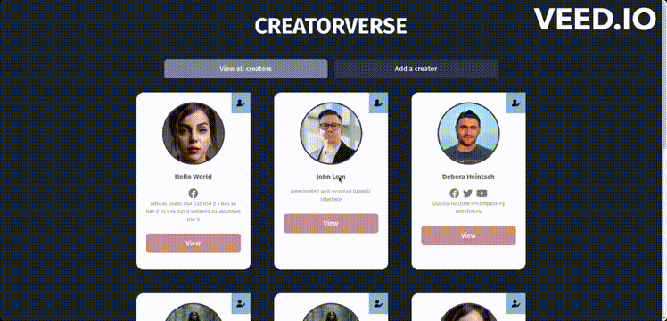

# WEB103 Prework - *👉🏿 Name of App Here*

Submitted by: **👉🏿 Androidmini9x**

About this web app: **👉🏿 Creatorverse is a simple web application built with React that allows you to manage and discover your favorite content creators.**

Time spent: **👉🏿 6** hours

## Required Features

The following **required** functionality is completed:

<!-- 👉🏿👉🏿👉🏿 Make sure to check off completed functionality below -->
- [x] **A logical component structure in React is used to create the frontend of the app**
- [x] **At least five content creators are displayed on the homepage of the app**
- [x] **Each content creator item includes their name, a link to their channel/page, and a short description of their content**
- [x] **API calls use the async/await design pattern via Axios or fetch()**
- [x] **Clicking on a content creator item takes the user to their details page, which includes their name, url, and description**
- [x] **Each content creator has their own unique URL**
- [x] **The user can edit a content creator to change their name, url, or description**
- [x] **The user can delete a content creator**
- [x] **The user can add a new content creator by entering a name, url, or description and then it is displayed on the homepage**

The following **optional** features are implemented:

- [x] Picocss is used to style HTML elements
- [x] The content creator items are displayed in a creative format, like cards instead of a list
- [x] An image of each content creator is shown on their content creator card

The following **additional** features are implemented:

* [x] List anything else that you added to improve the site's functionality!

## Video Walkthrough

Here's a walkthrough of implemented required features:

👉🏿

GIF created with ...  👉🏿 GIF tool here
For recorded video as GIF I used this site `veed.io`

## Notes

The project structure of Creatorverse follows a typical React application structure. Here's an overview of the main directories and files:

- `src`: Contains the source code of the React application.
  - `components`: Contains reusable components used throughout the app.
    - `ContentCreator.js`: Represents a content creator item, displaying their name, link, and description.
    - *Other components*
  - `pages`: Contains the main pages of the app.
    - `ShowCreators.js`: Displays the list of content creators on the homepage.
    - `ViewCreator.js`: Displays the details of a specific content creator.
    - `EditCreator.js`: Allows the user to edit the details of a content creator.
    - `AddCreator.js`: Allows the user to add a new content creator.
    - *Other pages*
  - `client.js`: Handles API requests using async/await fetch.
  - `App.js`: The root component of the application.
- `public`: Contains static assets and the HTML template for the app.

## Technologies Used

Creatorverse is built with the following technologies:
- React: A JavaScript library for building user interfaces.
- React Router: A routing library for React applications.
- Supabase: A database to store your content creators' information.
- Fetch: Used for making asynchronous API calls to retrieve and update data.
- HTML: The standard markup language for creating web pages.
- CSS: The styling language used to customize the appearance of the app.

## License

Creatorverse is released under the [MIT License](https://opensource.org/licenses/MIT). Feel free to use, modify, and distribute the code as per the terms of the license.

## Acknowledgements

This project was inspired by the need to manage and discover content creators from different platforms. We would like to thank the React and React Router communities for their excellent libraries, as well as the contributors to Axios and fetch for their powerful HTTP clients.

We hope you enjoy using Creatorverse and find it useful in managing your favorite content creators! If you have any questions or feedback, please don't hesitate to reach out. Happy creating!